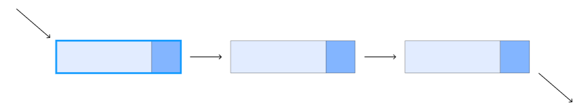
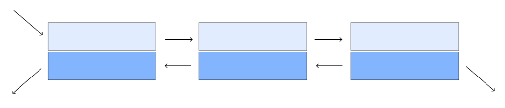
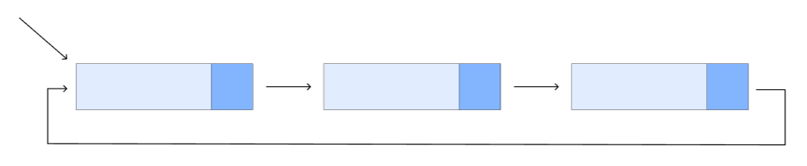

### 연결 리스트

링크드 리스트(linked list)는 **각 노드가 데이터와 포인터를 가지고 한 줄로 연결되어 있는 방식으로 데이터를 저장하는 자료 구조이다.**
이름에서 말하듯이 데이터를 담고 있는 노드들이 연결되어 있는데, 노드의 포인터가 다음이나 이전의 노드와의 연결을 담당하게 된다.

연결 리스트의 종류로는 단일 연결 리스트, 이중 연결 리스트 등이 있다.

연결 리스트는 늘어선 노드의 중간지점에서도 자료의 추가와 삭제가 O(1)의 시간에 가능하다는 장점을 갖는다. 그러나 배열이나 트리 구조와는 달리 특정 위치의 데이터를 검색해 내는데에는 O(n)의 시간이 걸리는 단점도 갖고 있다.

종류
단일 연결 리스트

단일 연결 리스트의 구조
단일 연결 리스트는 각 노드에 자료 공간과 한 개의 포인터 공간이 있고, 각 노드의 포인터는 다음 노드를 가리킨다.

이중 연결 리스트

이중 연결 리스트의 구조
이중 연결 리스트의 구조는 단일 연결 리스트와 비슷하지만, 포인터 공간이 두 개가 있고 각각의 포인터는 앞의 노드와 뒤의 노드를 가리킨다.

원형 연결 리스트

단순 원형 연결 리스트의 구조
원형 연결 리스트는 일반적인 연결 리스트에 마지막 노드와 처음 노드를 연결시켜 원형으로 만든 구조이다.
